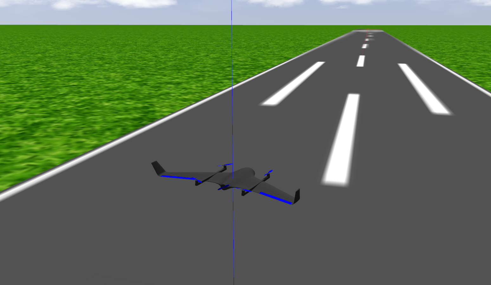
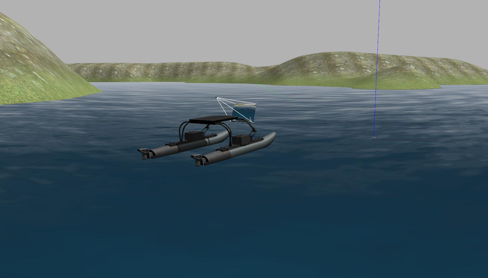
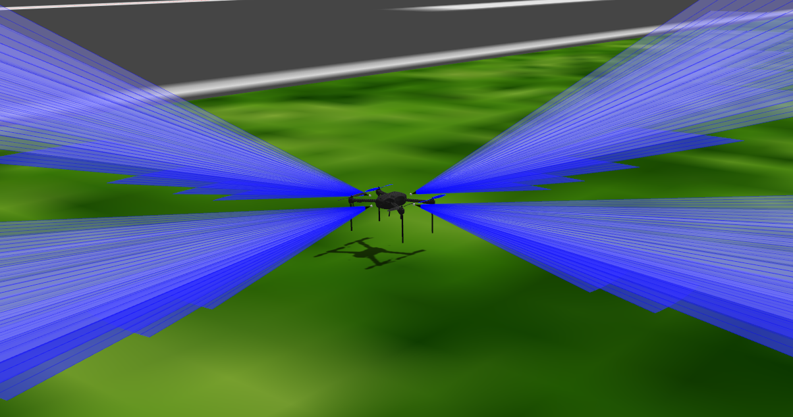
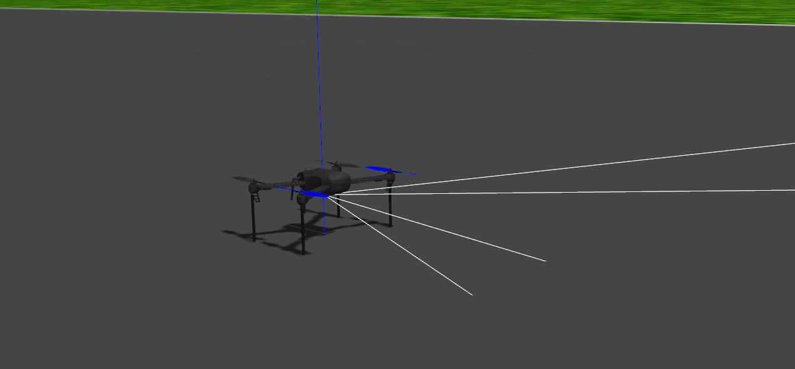

# IQ Simulations

This repo hosts gazebo worlds for various drone scenarios and various drone configurations. This Repo is specifically designed to work with the Ardupilot control system, and utilizes the ardupilot gazebo plugin to allow the ardupilot control software to interface and control the model drone in gazebo. 

## Vehicles Supported 

- [Quadcopters](#drone-simulations)
- [Quad-Planes](#quad-planes)
- [Boats](#boat-simulation)

## Drone Simulations 


This repo contains a couple different gazebo worlds containing various ardupilot drone configurations. The worlds are listed below

- `droneOnly.world` - simple gazebo world containing only a single drone
- `runway.world` - simple gazebo world containing only a single drone on a runway
- `lidar.world` - a simple gazebo world containing a single drone with a 2d lidar sensor
- `multi_drone.world` - a simple world containing 12 drones  

### Running Drone Simulations 

Each world contains a corresponding launch file. For example to launch `runway.world` run
```
roslaunch iq_sim runway.launch
``` 
Launch the ardupilot instance by running 
```
cd ~/ardupilot/ArduCopter/ && sim_vehicle.py -v ArduCopter -f gazebo-iris --console
``` 
For more information, take a look at the corresponding tutorials [here](https://github.com/Intelligent-Quads/iq_tutorials)

## Quad Planes 

Quad Planes are a vtol aircraft that uses quadcopter controls in hover and airplane controls in forward flight. 



### Setup 

In order to use the gazebo quad plane sim a few files needed to be modified in ardupilot the first is to add the following to the file `ardupilot/Tools/autotest/pysim/vehicleinfo.py` on line 274. this should be within the Arduplane structure. 

```
"gazebo-quadplane": {
    "waf_target": "bin/arduplane",
    "default_params_filename": "default_params/gazebo_quadplane.parm",
},
```

copy the file `iq_sim/scripts/vtol-params/gazebo_quadplane.parm` to `ardupilot/Tools/autotest/default_params/gazebo_quadplane.parm`

### Running VTOL sim

## Run Boat Sim 

First terminal 
```
roslaunch iq_sim vtol.launch
```
Second terminal
```
sim_vehicle.py -v ArduPlane -f gazebo-quadplane  -m --mav10 --console -I0
```


## Boat Simulation

Recently I have been experimenting with Ardurover for controlling an autonomous boat. Below shows the steps for installing for boat simulation. If you have already installed for quadcopter simulation, then most of the boat installation should already be completed. 

[boat setup](docs/boat_setup.md)



## Run Boat Sim 

First terminal 
```
roslaunch iq_sim boat.launch
```
Second terminal
```
sim_vehicle.py -v APMrover2 -f gazebo-rover  -m --mav10 --console -L Viridian
```


## IQ_SIM Models

### drone_with_sonar

Example drone with 4 sonars attached in each direction. Each sonar publishes a `sensor_msgs/Range` ROS msg containing range data.

topics 
```
/drone1/sensor/sonar/back
/drone1/sensor/sonar/front
/drone1/sensor/sonar/left
/drone1/sensor/sonar/right
```


### drone_with_camera 

Example drone with a forward facing camera. The camera published a `sensor_msgs/Image` ROS msg which can be used to view or do image processing on. 


